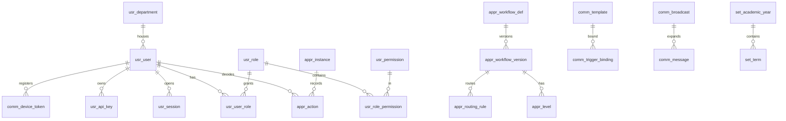
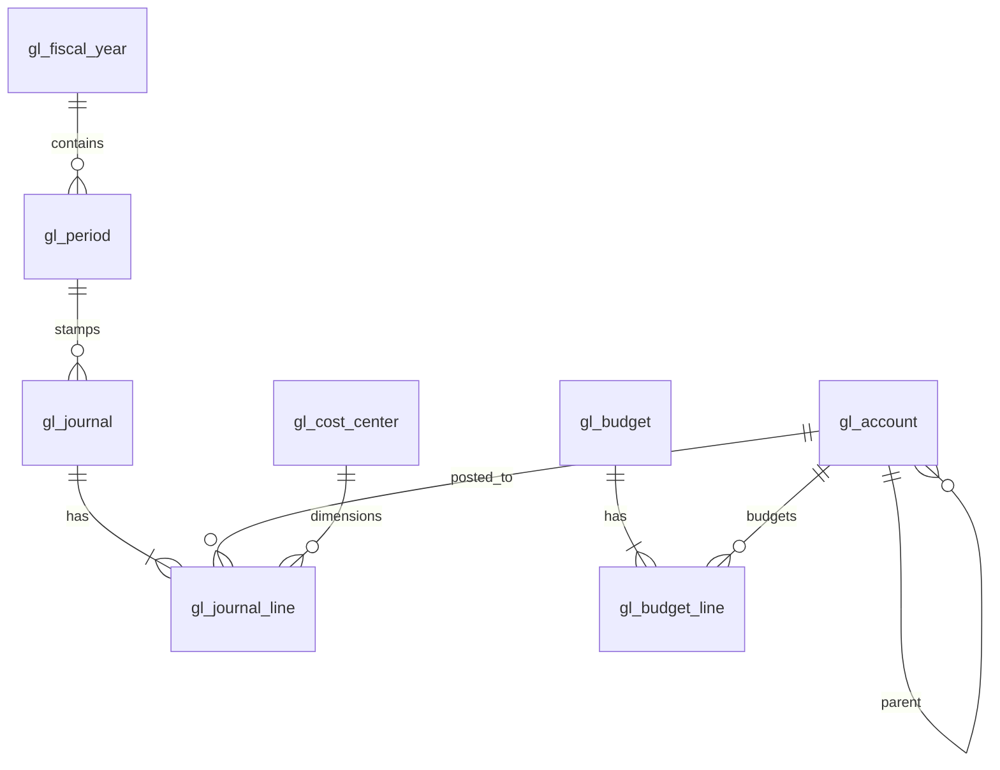

# KLICKIT FINANCE ERP — Phase 4

## Database Design (Part 2 of 4): Platform & Accounting Core Schema

| Field | Value |
|---|---|
| **Document ID** | KFE-DB-002 |
| **Version** | 1.0 · 14 July 2026 |
| **Covers** | usr_, audit, set_, brnd_, file_, comm_, appr_, obx_, gl_ |

Notation: compact DDL — `PK` = uuid primary key `id`; std = `created_at/updated_at/created_by/updated_by`; all tables include std unless noted. `→` = FK (RESTRICT unless noted). Types per KFE-DB-001 §3.

---

# 1. ERD — Platform



# 2. Users & Security (usr_)

```
usr_user
  PK, username varchar(60) UQ, email varchar(160) UQ NULL, phone varchar(20) UQ NULL,
  password_hash varchar(72), full_name varchar(120),
  status varchar(20) CK(INVITED|ACTIVE|SUSPENDED|DEACTIVATED),
  user_type varchar(20) CK(STAFF|PARENT|SYSTEM) DEFAULT 'STAFF',
  must_change_password bool DEFAULT true, twofa_enabled bool, twofa_secret_enc bytea NULL,
  recovery_codes_enc bytea NULL, department_id → usr_department NULL,
  authority_limit_amount NUMERIC(18,4) NULL, last_login_at timestamptz NULL,
  password_changed_at timestamptz, locale varchar(8) DEFAULT 'en', version int
  ix: uq_usr_user_username; uq_usr_user_email_p WHERE email IS NOT NULL;
      uq_usr_user_phone_p WHERE phone IS NOT NULL; ix_usr_user_department_id
  Note: CHECK (user_type='PARENT' OR phone IS NOT NULL OR email IS NOT NULL)

usr_role
  PK, name varchar(60) UQ, description text, is_system_template bool DEFAULT false,
  is_auditor_class bool DEFAULT false   -- BR-SEC-04 write-block marker
usr_permission
  PK, code varchar(80) UQ, module varchar(30), description text, is_write bool
usr_user_role       PK, user_id → usr_user, role_id → usr_role; uq(user_id, role_id)
usr_role_permission PK, role_id → usr_role, permission_id → usr_permission; uq(role_id, permission_id)
  Note: trigger trg_auditor_no_write rejects is_write=true perms on is_auditor_class roles

usr_department PK, name varchar(80) UQ, head_user_id → usr_user NULL
usr_sod_rule   PK, permission_a → usr_permission, permission_b → usr_permission,
               is_enabled bool; uq(permission_a, permission_b)   -- BR-SEC-01

usr_session
  PK, user_id → usr_user, refresh_token_hash varchar(64) UQ, family_id uuid,
  device varchar(160), ip inet, user_agent text, last_seen_at, revoked_at NULL,
  revoke_reason varchar(30) NULL
  ix: ix_usr_session_user_id; ix_usr_session_family_id;
      uq_usr_session_active covered by token hash

usr_login_event  (append-only, no std-update)
  PK, user_id → usr_user NULL, username_attempted varchar(60), success bool,
  failure_reason varchar(30) NULL, ip inet, device_fp varchar(64), at timestamptz
  ix: ix_usr_login_event_user_at (user_id, at DESC); BRIN(at)

usr_password_history PK, user_id → usr_user, password_hash varchar(72), at
usr_api_key
  PK, name varchar(80), key_hash varchar(64) UQ, prefix varchar(12),
  scopes jsonb, expires_at NULL, ip_allowlist inet[] NULL,
  last_used_at NULL, revoked_at NULL, owner_user_id → usr_user
```

# 3. Audit (audit schema)

```
audit.audit_log  (INSERT-only for kfe_app; no UPDATE/DELETE grants)
  PK, seq bigint GENERATED ALWAYS AS IDENTITY UQ,      -- chain order
  actor_id uuid NULL, actor_label varchar(80),         -- system principals too (BR-GEN-09)
  entity_type varchar(60), entity_id uuid, action varchar(30),
  before jsonb NULL, after jsonb NULL, ip inet NULL, session_id uuid NULL,
  at timestamptz DEFAULT now(),
  prev_hash varchar(64), hash varchar(64)              -- FR-AUD-002 chain
  ix: ix_audit_entity (entity_type, entity_id, at DESC);
      ix_audit_actor_at (actor_id, at DESC); BRIN(at)
  Note: payroll-amount fields envelope-encrypted inside before/after (FR-PYRL-012.1)
audit.chain_anchor  PK, up_to_seq bigint, anchor_hash varchar(64), at  -- sweep checkpoints
```

# 4. Settings, Branding, Files (set_, brnd_, file_)

```
set_setting        PK, key varchar(80) UQ, value jsonb, is_secret bool
                   -- secrets stored AES-256-GCM encrypted inside value
set_academic_year  PK, name varchar(20) UQ, starts_on date, ends_on date,
                   is_current bool; uq_set_year_current_p WHERE is_current
set_term           PK, academic_year_id → set_academic_year, name varchar(20), seq int,
                   starts_on, ends_on, is_current bool, billing_locked bool DEFAULT false;
                   uq(academic_year_id, seq); uq_set_term_current_p WHERE is_current
set_numbering_series
  PK, doc_type varchar(30), series_code varchar(10) DEFAULT 'MAIN',
  prefix varchar(12), pad_width int, reset_policy varchar(10) CK(NEVER|YEARLY|TERMLY),
  period_key varchar(12),                -- e.g. '2026' when reset_policy=YEARLY
  next_no bigint CHECK (next_no > 0)
  uq(doc_type, series_code, period_key)  -- allocator: SELECT … FOR UPDATE (NFR-INT-003)
set_integration_config
  PK, kind varchar(30) CK(SMTP|SMS|FCM|MPESA|QUICKBOOKS|XERO|SAGE|BANK|WHATSAPP),
  name varchar(60), config_enc bytea, is_enabled bool, priority int,
  last_tested_at NULL, last_test_ok bool NULL; uq(kind, name)
set_custom_field_def
  PK, entity varchar(30) CK(STUDENT|SUPPLIER|EMPLOYEE|ASSET), key varchar(40),
  label varchar(80), field_type varchar(10) CK(TEXT|NUMBER|DATE|SELECT),
  options jsonb NULL, is_required bool; uq(entity, key)

brnd_theme
  PK, name varchar(60), status varchar(10) CK(DRAFT|PUBLISHED|ARCHIVED),
  tokens jsonb,               -- colors, fonts, radii (FR-BRND-001.1)
  logo_file_id → file_object NULL, favicon_file_id → file_object NULL,
  login_config jsonb, document_config jsonb,  -- headers/footers/watermark/signatures
  published_at NULL; uq_brnd_theme_published_p WHERE status='PUBLISHED'

file_object
  PK, bucket varchar(40), object_key varchar(200) UQ, original_name varchar(200),
  mime varchar(100), size_bytes bigint, sha256 varchar(64),
  entity_type varchar(60) NULL, entity_id uuid NULL, uploaded_by → usr_user
  ix: ix_file_object_entity (entity_type, entity_id)
```

# 5. Communications (comm_)

```
comm_template
  PK, event_code varchar(50), channel varchar(10) CK(SMS|EMAIL|PUSH|WHATSAPP|INAPP),
  locale varchar(8) DEFAULT 'en', subject varchar(200) NULL, body text,
  variables jsonb, is_active bool; uq(event_code, channel, locale)
comm_trigger_binding
  PK, event_code varchar(50), channel varchar(10), is_enabled bool,
  audience_rule jsonb NULL; uq(event_code, channel)
comm_message  (send log — high volume)
  PK, channel varchar(10), recipient varchar(160), template_event varchar(50) NULL,
  broadcast_id → comm_broadcast NULL, entity_type varchar(60) NULL, entity_id uuid NULL,
  body_rendered text, status varchar(15) CK(QUEUED|SENT|DELIVERED|FAILED|OPTED_OUT),
  provider varchar(40) NULL, provider_ref varchar(80) NULL, cost_amount NUMERIC(18,4) NULL,
  segments int NULL, error text NULL, queued_at, sent_at NULL, delivered_at NULL
  ix: ix_comm_message_status_p WHERE status IN ('QUEUED','FAILED');
      ix_comm_message_entity (entity_type, entity_id); BRIN(queued_at)
comm_broadcast
  PK, title varchar(120), audience_def jsonb, channel varchar(10), body text,
  recipient_count int, est_cost_amount NUMERIC(18,4), status varchar(15)
  CK(DRAFT|PENDING_APPROVAL|APPROVED|SENDING|SENT|CANCELLED), approval_ref uuid NULL
comm_device_token PK, user_id → usr_user, token varchar(300) UQ, platform varchar(10),
                  last_seen_at
comm_optout       PK, guardian_id uuid, channel varchar(10), scope varchar(30); uq(guardian_id, channel, scope)
```

# 6. Approvals & Outbox (appr_, obx_)

```
appr_workflow_def      PK, domain_code varchar(30) UQ, name varchar(80), is_active bool
appr_workflow_version  PK, workflow_def_id → appr_workflow_def, version int,
                       is_current bool; uq(workflow_def_id, version)
appr_level
  PK, workflow_version_id → appr_workflow_version, seq int,
  approver_type varchar(20) CK(ROLE|USERS|DEPT_HEAD), role_id → usr_role NULL,
  user_ids uuid[] NULL, mode varchar(10) CK(SEQUENTIAL|PARALLEL),
  quorum int DEFAULT 1, sla_hours int NULL, escalation jsonb NULL; uq(workflow_version_id, seq)
appr_routing_rule
  PK, workflow_version_id →, min_amount NUMERIC(18,4), max_amount NUMERIC(18,4) NULL,
  level_subset int[] NULL, department_id → usr_department NULL
appr_instance
  PK, workflow_version_id →, domain_code varchar(30), entity_type varchar(60),
  entity_id uuid, amount NUMERIC(18,4) NULL, initiator_id → usr_user,
  status varchar(15) CK(PENDING|APPROVED|REJECTED|RETURNED|CANCELLED),
  current_level int, submitted_at, decided_at NULL
  ix: ix_appr_instance_pending_p (current_level) WHERE status='PENDING';
      ix_appr_instance_entity (entity_type, entity_id); uq one PENDING per entity:
      uq_appr_instance_open_p (entity_type, entity_id) WHERE status='PENDING'
appr_action
  PK, instance_id → appr_instance, level_seq int, actor_id → usr_user,
  decision varchar(10) CK(APPROVE|REJECT|RETURN), comment text, acted_at,
  was_delegated_from → usr_user NULL
  Note: trigger blocks actor_id = instance.initiator_id (BR-APPR-01 at DB)
appr_delegation PK, from_user_id → usr_user, to_user_id → usr_user,
                starts_on date, ends_on date, reason text
                CHECK (from_user_id <> to_user_id)

obx_outbox
  PK, seq bigint IDENTITY, aggregate_type varchar(60), aggregate_id uuid,
  event_type varchar(60), payload jsonb, occurred_at, published_at NULL
  ix: ix_obx_unpublished_p (seq) WHERE published_at IS NULL
obx_consumer_mark PK, consumer varchar(60), event_id uuid; uq(consumer, event_id)  -- idempotency
```

# 7. ERD — Accounting Core



# 8. General Ledger (gl_)

```
gl_account
  PK, code varchar(20) UQ, name varchar(120), class varchar(15)
  CK(ASSET|LIABILITY|EQUITY|INCOME|EXPENSE), parent_id → gl_account NULL,
  is_postable bool, is_control bool, control_domain varchar(20) NULL
  CK(NULL|AR_STUDENT|AR_SPONSOR|AP_SUPPLIER|WALLET|INVENTORY|PAYROLL|PREPAYMENT|MPESA_CLEARING|TRANSFER_CLEARING),
  is_active bool, tax_treatment varchar(20) NULL, version int
  ix: ix_gl_account_parent_id; ix_gl_account_class
  Note: CHECK (is_postable = false OR parent_id IS NOT NULL) roots are headers;
        deactivation only (BR-ACC-01) — no DELETE grant on rows with postings (trigger)

gl_fiscal_year PK, name varchar(20) UQ, starts_on, ends_on,
               status varchar(10) CK(OPEN|CLOSING|LOCKED)
gl_period
  PK, fiscal_year_id → gl_fiscal_year, seq int, starts_on, ends_on,
  status varchar(15) CK(OPEN|SOFT_CLOSED|HARD_CLOSED); uq(fiscal_year_id, seq)
  ix: ix_gl_period_dates (starts_on, ends_on)

gl_journal   (immutable after insert — trg_gl_journal_immutable)
  PK, number varchar(30) UQ, journal_date date, period_id → gl_period,
  source_module varchar(20), source_doc_type varchar(30), source_doc_id uuid,
  narration text, journal_type varchar(15) CK(SYSTEM|MANUAL|REVERSING|CLOSING|OPENING),
  reversal_of_id → gl_journal NULL, approval_ref uuid NULL, posted_by, posted_at
  ix: ix_gl_journal_source (source_doc_type, source_doc_id);
      ix_gl_journal_period_id; ix_gl_journal_date
gl_journal_line  (immutable; the biggest table — partition-ready by year)
  PK, journal_id → gl_journal CASCADE, line_no int, account_id → gl_account,
  cost_center_id → gl_cost_center NULL, debit NUMERIC(18,4) DEFAULT 0,
  credit NUMERIC(18,4) DEFAULT 0, memo varchar(200) NULL,
  entity_ref_type varchar(30) NULL, entity_ref_id uuid NULL   -- sub-ledger link
  CHECK ((debit = 0) <> (credit = 0))          -- exactly one side, nonzero
  CHECK (debit >= 0 AND credit >= 0)
  ix: ix_gl_line_account_journal (account_id, journal_id);
      ix_gl_line_entity (entity_ref_type, entity_ref_id) WHERE entity_ref_id IS NOT NULL;
      BRIN via journal posted_at (join path)
  trg: trg_gl_journal_balanced (deferred, per journal Σd=Σc — BR-GEN-02)
       trg_gl_writer_guard (posting-service-only writes — KFE-DB-001 §1)
       trg_gl_period_open (reject HARD_CLOSED period — BR-GEN-04)

gl_period_account_total  (posting-service-maintained aggregate — N-6)
  PK, period_id → gl_period, account_id → gl_account,
  cost_center_id → gl_cost_center NULL,
  debit_total NUMERIC(18,4), credit_total NUMERIC(18,4)
  uq(period_id, account_id, cost_center_id)
  -- trial balance/statements read this; sweep re-derives from lines hourly

gl_cost_center PK, code varchar(20) UQ, name varchar(80), is_active bool
gl_budget      PK, fiscal_year_id →, name varchar(80), version_label varchar(20),
               status varchar(15) CK(DRAFT|PENDING_APPROVAL|ACTIVE|SUPERSEDED),
               approval_ref uuid NULL; uq_gl_budget_active_p (fiscal_year_id) WHERE status='ACTIVE'
gl_budget_line PK, budget_id → gl_budget CASCADE, account_id → gl_account,
               cost_center_id NULL, period_phasing jsonb, annual_amount NUMERIC(18,4)
               uq(budget_id, account_id, cost_center_id)
gl_integrity_run  PK, ran_at, kind varchar(20), ok bool, findings jsonb  -- NFR-INT-002 log
```

## Key invariants realized at DB level (this group)

| Invariant | Mechanism |
|---|---|
| Journals balance (BR-GEN-02) | Deferred constraint trigger per journal |
| Only posting service writes GL | `trg_gl_writer_guard` on journal+lines+totals |
| No posting to closed periods (BR-GEN-04) | `trg_gl_period_open` |
| Journal immutability (BR-GEN-03) | UPDATE/DELETE-rejecting triggers |
| Exactly-one-side lines | CHECK `(debit=0) <> (credit=0)` |
| One current term/year; one published theme; one active budget | Partial unique indexes |
| Audit log tamper evidence | INSERT-only grants + hash chain + anchors |

---

*Continue to KFE-DB-003 (Student Finance schema).*
