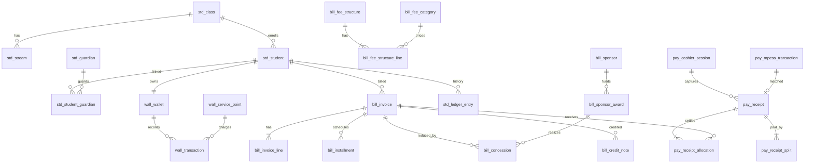

# KLICKIT FINANCE ERP — Phase 4

## Database Design (Part 3 of 4): Student Finance Schema

| Field | Value |
|---|---|
| **Document ID** | KFE-DB-003 |
| **Version** | 1.0 · 14 July 2026 |
| **Covers** | std_, bill_, pay_, wall_ |

---

# 1. ERD — Student Finance



# 2. Students (std_)

```
std_class   PK, name varchar(40) UQ, level int, is_active bool
std_stream  PK, class_id → std_class, name varchar(40); uq(class_id, name)
std_fee_group PK, name varchar(60) UQ, description text

std_student
  PK, admission_no varchar(30) UQ, first_name varchar(60), middle_name NULL,
  last_name varchar(60), search_name varchar(200) GENERATED (lower(concat)),
  class_id → std_class, stream_id → std_stream NULL,
  status varchar(15) CK(ACTIVE|ALUMNI|TRANSFERRED|SUSPENDED|WITHDRAWN),
  boarding varchar(10) CK(DAY|BOARDER), fee_group_id → std_fee_group NULL,
  sponsor_id → bill_sponsor NULL, transport_route_id → bill_transport_route NULL,
  photo_file_id → file_object NULL, custom_fields jsonb DEFAULT '{}',
  enrolled_on date, exited_on date NULL, exit_cleared bool DEFAULT false, version int
  ix: GIN trgm (search_name, admission_no)  -- FR-PAY-002 ≤2s lookup
      ix_std_student_class (class_id, stream_id) WHERE status='ACTIVE'
  Note: BR-BILL-15 clearance enforced in service; exit_cleared gate at DB for status flips
        via trg_std_student_exit_guard

std_guardian
  PK, full_name varchar(120), phone varchar(20) UQ, email varchar(160) NULL,
  national_id varchar(20) NULL, user_id → usr_user NULL,   -- portal account link
  payout_verified jsonb NULL                                -- BR-WALL-06 targets
std_student_guardian
  PK, student_id → std_student, guardian_id → std_guardian,
  relationship varchar(30), is_primary bool, receives_billing bool DEFAULT true
  uq(student_id, guardian_id); uq_primary_p (student_id) WHERE is_primary

std_ledger_entry   (student sub-ledger — append-only, written by posting flows)
  PK, student_id → std_student, entry_date date, posted_at timestamptz,
  doc_type varchar(30), doc_id uuid, doc_number varchar(30),
  debit NUMERIC(18,4) DEFAULT 0, credit NUMERIC(18,4) DEFAULT 0, memo varchar(200)
  ix: ix_std_ledger_student_at (student_id, posted_at);  BRIN(posted_at)
  -- running balance computed by window function; Σ per student must equal
  -- AR control lines with entity_ref (sweep NFR-INT-002)

std_promotion_batch PK, from_year_id → set_academic_year, to_year_id →, executed_at,
                    summary jsonb   -- FR-BILL-005 audit of rollover
```

# 3. Billing (bill_)

```
bill_fee_category
  PK, name varchar(60) UQ, gl_income_account_id → gl_account, taxable bool,
  is_active bool, priority int   -- allocation order for category-priority policy
bill_transport_route PK, name varchar(60) UQ, amount NUMERIC(18,4), is_active bool

bill_fee_structure
  PK, academic_year_id →, class_id → std_class,
  stream_id NULL, boarding varchar(10) NULL, fee_group_id NULL,
  version int, status varchar(12) CK(DRAFT|PUBLISHED|SUPERSEDED),
  published_at NULL, published_by NULL
  uq(academic_year_id, class_id, coalesce-scope, version)  -- realized as expression index
  Note: trg_bill_structure_immutable freezes lines once PUBLISHED (BR-BILL-03)
  Phase 6 Slice 3b (2026-07-29, migration 0210): a structure now spans a WHOLE
  academic year, not a single term — term_id moved OFF this table and onto
  bill_fee_structure_line (below), so one structure can price multiple terms'
  worth of categories at once, each on its own term/due date.
bill_fee_structure_line
  PK, fee_structure_id → bill_fee_structure CASCADE, fee_category_id →,
  term_id → set_term (Slice 3b, migration 0210), due_date date NOT NULL (Slice 3b),
  amount NUMERIC(18,4) CHECK (amount >= 0), is_optional bool DEFAULT false
  uq(fee_structure_id, fee_category_id, term_id)  -- widened in Slice 3b (was
  (fee_structure_id, fee_category_id) — a structure may now legitimately have
  two lines for the same category priced in two different terms)
bill_student_optional_item
  PK, student_id →, term_id →, fee_category_id →, amount_override NUMERIC(18,4) NULL
  uq(student_id, term_id, fee_category_id)   -- FR-BILL-013

bill_invoice
  PK, number varchar(30) UQ, student_id → std_student, term_id → set_term,
  fee_structure_id → bill_fee_structure NULL, structure_version int NULL,
  issue_date date, due_date date CHECK (due_date >= issue_date),
  status varchar(18) CK(DRAFT|PENDING_APPROVAL|APPROVED|POSTED|PARTIALLY_PAID|PAID|VOID),
  source varchar(12) CK(STRUCTURE|ADHOC|RECURRING|DEBIT_NOTE),
  subtotal NUMERIC(18,4), concession_total NUMERIC(18,4) DEFAULT 0,
  total NUMERIC(18,4), paid_amount NUMERIC(18,4) DEFAULT 0,
  balance NUMERIC(18,4),                    -- N-1 derived cache
  journal_id → gl_journal NULL, void_reason text NULL, voided_by NULL, version int
  CHECK (balance = total - paid_amount) ; CHECK (paid_amount BETWEEN 0 AND total)
  ix: ix_bill_invoice_student (student_id, status);
      ix_bill_invoice_open_p (due_date) INCLUDE (student_id, balance) WHERE balance > 0;
      uq idempotency: uq_bill_invoice_structure_p (student_id, term_id, fee_structure_id)
        WHERE source='STRUCTURE' AND status <> 'VOID'      -- BR-BILL-04
  trg: trg_bill_invoice_immutable (financial cols frozen when POSTED+,
       except paid_amount/balance/status via allocation path)
bill_invoice_line
  PK, invoice_id → bill_invoice CASCADE, line_no int, fee_category_id →,
  description varchar(160), amount NUMERIC(18,4) CHECK (amount >= 0),
  concession_amount NUMERIC(18,4) DEFAULT 0 CHECK (concession_amount <= amount)

bill_installment
  PK, invoice_id → bill_invoice, seq int, due_date date, amount NUMERIC(18,4) > 0,
  settled_amount NUMERIC(18,4) DEFAULT 0; uq(invoice_id, seq)
  trg: deferred trg_bill_installments_sum (Σ amounts = invoice balance at plan creation — BR-BILL-05)

bill_concession_scheme
  PK, name varchar(80) UQ, kind varchar(12) CK(WAIVER|DISCOUNT|SCHOLARSHIP|BURSARY),
  calc varchar(10) CK(PERCENT|FIXED), value NUMERIC(18,4), category_scope uuid[] NULL,
  allows_stacking bool DEFAULT false, gl_account_id → gl_account, is_active bool
bill_concession
  PK, kind varchar(12), scheme_id → bill_concession_scheme NULL,
  student_id →, invoice_id → bill_invoice NULL, invoice_line_id NULL,
  sponsor_award_id → bill_sponsor_award NULL, amount NUMERIC(18,4) > 0,
  reason text, status varchar(18) CK(PENDING_APPROVAL|APPROVED|POSTED|REJECTED),
  approval_ref uuid NULL, journal_id → gl_journal NULL
  ix: ix_bill_concession_invoice; ix_bill_concession_student

bill_sponsor  PK, name varchar(120) UQ, contacts jsonb, agreement_file_id NULL,
              allows_cash_conversion bool DEFAULT false   -- BR-BILL-13
bill_sponsor_award
  PK, sponsor_id → bill_sponsor, student_id →, term_id →,
  amount NUMERIC(18,4) > 0, category_scope uuid[] NULL,
  applied_amount NUMERIC(18,4) DEFAULT 0 CHECK (applied_amount <= amount)

bill_credit_note / bill_debit_note
  PK, number varchar(30) UQ, invoice_id → (credit) / student_id → (debit),
  lines jsonb→ separate *_line tables mirror invoice_line shape,
  reason text, status CK(DRAFT|PENDING_APPROVAL|APPROVED|POSTED),
  approval_ref, journal_id, total NUMERIC(18,4) > 0

bill_refund_voucher
  PK, number varchar(30) UQ, student_id →, amount NUMERIC(18,4) > 0,
  method varchar(10) CK(CASH|BANK|MPESA_B2C), payee jsonb,
  status varchar(18) CK(DRAFT|PENDING_APPROVAL|APPROVED|APPROVED_UNPAID|PAID|CANCELLED),
  approval_ref, journal_id NULL, b2c_transaction_id → pay_mpesa_transaction NULL

bill_late_fee_policy PK, name, mode CK(FLAT|PERCENT|TIERED), params jsonb,
                     grace_days int, requires_approval bool, is_active bool
bill_late_fee_batch  PK, policy_id →, run_date, status CK(DRAFT|PENDING_APPROVAL|POSTED),
                     approval_ref NULL, summary jsonb
```

# 4. Payments (pay_)

```
pay_cashier_session
  PK, cashier_id → usr_user, till varchar(30), status varchar(10) CK(OPEN|CLOSED),
  opened_at, float_amount NUMERIC(18,4), closed_at NULL,
  counted jsonb NULL,            -- denomination breakdown
  expected_totals jsonb NULL, variance_amount NUMERIC(18,4) NULL,
  variance_reason text NULL, supervisor_id → usr_user NULL
  uq_pay_session_open_p (cashier_id) WHERE status='OPEN'   -- BR-PAY-04

pay_receipt
  PK, number varchar(30) UQ, student_id → std_student, payer_name varchar(120),
  payer_phone varchar(20) NULL, receipt_date date, total NUMERIC(18,4) > 0,
  status varchar(10) CK(POSTED|REVERSED), reversal_of_id → pay_receipt NULL,
  reversal_reason varchar(20) NULL, approval_ref NULL,
  cashier_id → usr_user, session_id → pay_cashier_session NULL,
  journal_id → gl_journal, idempotency_key varchar(64) UQ NULL,
  balance_after NUMERIC(18,4),   -- student balance snapshot for the printed receipt
  reprint_count int DEFAULT 0
  ix: ix_pay_receipt_student (student_id, receipt_date DESC);
      ix_pay_receipt_session; BRIN(created_at)
  trg: immutability when POSTED (reversal path only)
pay_receipt_split
  PK, receipt_id → pay_receipt CASCADE, method varchar(12)
  CK(CASH|BANK|CHEQUE|CARD|POS|MPESA_STK|MPESA_C2B|MPESA_TILL|WALLET|BANK_TRANSFER),
  amount NUMERIC(18,4) > 0, bank_account_id → bank_account NULL,
  cheque_id → pay_cheque NULL, mpesa_transaction_id → pay_mpesa_transaction NULL,
  external_ref varchar(60) NULL
  trg: deferred trg_pay_splits_sum (Σ splits = receipt total — BR-PAY-01)
pay_receipt_allocation
  PK, receipt_id → pay_receipt CASCADE, invoice_id → bill_invoice NULL,
  installment_id → bill_installment NULL, to_prepayment bool DEFAULT false,
  amount NUMERIC(18,4) > 0
  trg: deferred Σ allocations = receipt total; prepayment rows update student credit

pay_cheque
  PK, bank_name varchar(80), cheque_no varchar(30), cheque_date date,
  drawer varchar(120), amount NUMERIC(18,4) > 0,
  status varchar(10) CK(UNCLEARED|CLEARED|BOUNCED), status_changed_at NULL,
  bounce_fee_applied bool DEFAULT false; uq(bank_name, cheque_no, drawer)

pay_mpesa_transaction
  PK, kind varchar(6) CK(STK|C2B|B2C), shortcode varchar(12),
  msisdn_masked varchar(20), amount NUMERIC(18,4),
  mpesa_ref varchar(20) UQ NULL,          -- BR-PAY-06 global uniqueness
  checkout_request_id varchar(60) UQ NULL, conversation_id varchar(60) UQ NULL,
  bill_ref varchar(60) NULL, state varchar(15)
  CK(INITIATED|PENDING|CONFIRMED|FAILED|TIMEOUT|REVERSED),
  raw_request jsonb, raw_callback jsonb NULL, matched_receipt_id → pay_receipt NULL,
  wallet_transaction_id → wall_transaction NULL
  ix: ix_pay_mpesa_state_p (created_at) WHERE state IN ('INITIATED','PENDING');
      ix_pay_mpesa_bill_ref

pay_suspense_item
  PK, source varchar(10) CK(C2B|BANK|OTHER), amount NUMERIC(18,4) > 0,
  external_ref varchar(60), raw jsonb, received_at,
  state varchar(10) CK(OPEN|MATCHED|REFUNDED), resolved_receipt_id NULL,
  resolved_by NULL, resolved_at NULL, resolution_note text
  ix: ix_pay_suspense_open_p (received_at) WHERE state='OPEN'   -- BR-PAY-07

pay_bulk_allocation_batch  PK, instrument jsonb, total NUMERIC(18,4), status,
                           created_receipts int; + _line child (student, amount, receipt_id)
```

# 5. Wallet (wall_)

```
wall_wallet
  PK, student_id → std_student UQ, status varchar(10) CK(ACTIVE|LOCKED|FROZEN|CLOSED),
  balance NUMERIC(18,4) DEFAULT 0,                    -- N-2 cache under row lock
  overdraft_limit NUMERIC(18,4) DEFAULT 0 CHECK (overdraft_limit >= 0),
  daily_limit NUMERIC(18,4) NULL, txn_limit NUMERIC(18,4) NULL,
  category_blocks varchar(20)[] DEFAULT '{}', status_reason text NULL, version int
  CHECK (balance >= -overdraft_limit)                 -- BR-WALL-01 floor
  Note: CLOSED requires balance = 0 (trg — BR-WALL-07)

wall_transaction  (append-only)
  PK, wallet_id → wall_wallet, type varchar(14)
  CK(TOPUP|SPEND|TRANSFER_IN|TRANSFER_OUT|FEE_TRANSFER|REFUND|ADJUSTMENT),
  amount NUMERIC(18,4) > 0, direction char(1) CK(D|C),
  balance_after NUMERIC(18,4),                        -- audit-visible running balance
  service_point_id → wall_service_point NULL, items jsonb NULL,
  counterparty_wallet_id → wall_wallet NULL,          -- transfers
  receipt_id → pay_receipt NULL, journal_id → gl_journal,
  approval_ref uuid NULL, reason_code varchar(20) NULL,
  idempotency_key varchar(64) UQ, actor_id, at timestamptz
  ix: ix_wall_txn_wallet_at (wallet_id, at DESC);
      ix_wall_txn_service_point (service_point_id, at) WHERE service_point_id IS NOT NULL;
      BRIN(at)
  Note: daily-limit checks compute Σ SPEND for wallet where at::date = today
        under the wallet row lock — index above serves it

wall_service_point
  PK, name varchar(80) UQ, type varchar(12)
  CK(TRANSPORT|LIBRARY|SHOP|MEALS|PRINTING|TRIPS|ACTIVITIES|EMERGENCY|CUSTOM),
  gl_income_account_id → gl_account, is_active bool,
  per_txn_limit NUMERIC(18,4) NULL
wall_service_point_operator
  PK, service_point_id →, user_id → usr_user; uq(service_point_id, user_id)
```

# 6. Access-Path → Index Traceability (this group)

| Query (source) | Served by |
|---|---|
| Cashier student search ≤2 s (FR-PAY-002) | GIN trgm on `std_student.search_name/admission_no` |
| Open invoices for allocation (FR-PAY-005) | `ix_bill_invoice_student (student_id, status)` |
| Defaulters/aging (FR-BILL-062/063) | `ix_bill_invoice_open_p` covering partial |
| Student statement any range (FR-BILL-060) | `ix_std_ledger_student_at` |
| Wallet statement + daily-limit sum (FR-WALL-010/012) | `ix_wall_txn_wallet_at` |
| STK pending fallback sweep (FR-PAY-008.1) | `ix_pay_mpesa_state_p` |
| Suspense digest (BR-PAY-07) | `ix_pay_suspense_open_p` |
| C2B auto-match by bill ref | `ix_pay_mpesa_bill_ref` |
| Session close totals (FR-PAY-011) | `ix_pay_receipt_session` |
| Sub-ledger ↔ control sweeps (NFR-INT-002) | `ix_gl_line_entity` (DB-002) + group indexes above |

---

*Continue to KFE-DB-004 (Operations & Licensing schema).*
