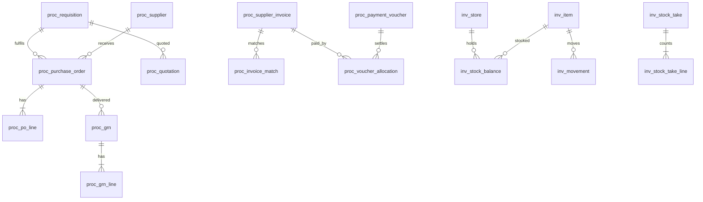

# KLICKIT FINANCE ERP — Phase 4

## Database Design (Part 4 of 4): Operations, Payroll, Banking, Assets & Licensing Schema

| Field | Value |
|---|---|
| **Document ID** | KFE-DB-004 |
| **Version** | 1.0 · 14 July 2026 |
| **Covers** | proc_, inv_, exp_, pyrl_, bank_, fa_, rpt_, intg_, bkp_, license.* + materialized views |

---

# 1. ERD — Procure-to-Pay & Inventory



# 2. Procurement (proc_)

```
proc_supplier
  PK, name varchar(120) UQ, trading_name NULL, kra_pin varchar(15) NULL,
  contacts jsonb, payment_details jsonb,          -- bank/M-Pesa (encrypted fields)
  categories varchar(40)[], payment_terms_days int DEFAULT 30,
  status varchar(12) CK(ACTIVE|BLACKLISTED|INACTIVE), blacklist_reason NULL,
  rating_delivery NUMERIC(3,2) NULL, rating_quality NUMERIC(3,2) NULL,
  rating_manual NUMERIC(3,2) NULL, version int
  ix: GIN trgm(name)

proc_requisition
  PK, number varchar(30) UQ, requested_by → usr_user, department_id →,
  justification text, status varchar(18)
  CK(DRAFT|SUBMITTED|PENDING_APPROVAL|APPROVED|REJECTED|CONVERTED|CANCELLED),
  approval_ref, budget_snapshot jsonb, total_estimate NUMERIC(18,4)
  + proc_requisition_line (item_id → inv_item NULL, free_text NULL, qty, est_price, budget_line_id →)

proc_quotation
  PK, requisition_id →, supplier_id →, quote_date, valid_until NULL,
  document_file_id → file_object NULL, total NUMERIC(18,4), terms text,
  is_awarded bool DEFAULT false, award_reason text NULL
  uq_award_p (requisition_id) WHERE is_awarded    -- one award per requisition
  + proc_quotation_line (item ref, qty, unit_price)

proc_purchase_order
  PK, number varchar(30) UQ, revision int DEFAULT 0, supersedes_id → self NULL,
  supplier_id → proc_supplier, requisition_id NULL, quotation_id NULL,
  status varchar(15) CK(DRAFT|PENDING_APPROVAL|APPROVED|ISSUED|PARTIALLY_RECEIVED|RECEIVED|CLOSED|CANCELLED),
  approval_ref, order_date, delivery_terms text, payment_terms_days int,   -- snapshot (N-4)
  subtotal, tax_amount, total, issued_at NULL
  trg: immutable once ISSUED (revision path only — FR-PROC-004.1)
proc_po_line
  PK, po_id → CASCADE, line_no, item_id → inv_item NULL, description varchar(200),
  qty NUMERIC(14,4) > 0, unit_price NUMERIC(18,4) >= 0, received_qty NUMERIC(14,4) DEFAULT 0,
  CHECK (received_qty <= qty * (1 + tolerance handled in svc; hard cap via grn trigger))

proc_grn
  PK, number varchar(30) UQ, po_id → proc_purchase_order, received_by → usr_user,
  received_at, status varchar(12) CK(DRAFT|POSTED), journal_id NULL, notes text
proc_grn_line
  PK, grn_id → CASCADE, po_line_id → proc_po_line, received_qty > 0,
  rejected_qty NUMERIC(14,4) DEFAULT 0, rejection_reason NULL, unit_cost NUMERIC(18,4)
  trg: trg_proc_grn_qty_cap — Σ grn received per po_line ≤ po qty + tolerance (BR-PROC-03)

proc_supplier_invoice
  PK, number varchar(30) UQ, supplier_ref varchar(60), supplier_id →,
  po_id NULL, invoice_date, due_date, total NUMERIC(18,4) > 0,
  status varchar(15) CK(UNMATCHED|MATCH_EXCEPTION|MATCHED|POSTED|PAID|PARTIALLY_PAID),
  match_variance jsonb NULL, approval_ref NULL, journal_id NULL,
  paid_amount NUMERIC(18,4) DEFAULT 0
  ix: ix_proc_inv_supplier_open (supplier_id) WHERE status IN ('POSTED','PARTIALLY_PAID')

proc_payment_voucher
  PK, number varchar(30) UQ, supplier_id →, method CK(BANK|CHEQUE|MPESA|CASH),
  bank_account_id → bank_account NULL, cheque_leaf_id → bank_cheque_leaf NULL,
  total NUMERIC(18,4) > 0, status CK(DRAFT|PENDING_APPROVAL|APPROVED|PAID|CANCELLED),
  approval_ref, journal_id NULL, remittance_sent bool
proc_voucher_allocation
  PK, voucher_id → CASCADE, supplier_invoice_id →, amount > 0
  trg: Σ allocations = voucher total; allocation ≤ invoice open balance (BR-PROC-04)

proc_contract PK, supplier_id →, title, starts_on, ends_on, value NUMERIC(18,4) NULL,
              renewal_alert_days int, document_file_id NULL, status
```

# 3. Inventory (inv_)

```
inv_category PK, name UQ, parent_id → self NULL
inv_store    PK, name UQ, location varchar(120), keeper_user_id →, is_active bool
inv_item
  PK, code varchar(30) UQ, name varchar(120), category_id →, uom varchar(20),
  uom_conversions jsonb NULL, barcode varchar(60) UQ NULL,
  item_type varchar(12) CK(STOCK|CONSUMABLE|SERVICE|RESALE),
  reorder_level NUMERIC(14,4) NULL, reorder_qty NUMERIC(14,4) NULL,
  preferred_supplier_ids uuid[] NULL,
  gl_asset_account_id → gl_account, gl_expense_account_id →, gl_income_account_id NULL,
  sale_price NUMERIC(18,4) NULL, avg_cost NUMERIC(18,6) DEFAULT 0, is_active bool, version int
  CHECK (item_type <> 'RESALE' OR (sale_price IS NOT NULL AND gl_income_account_id IS NOT NULL))  -- BR-INV-04
  ix: GIN trgm(name); ix_inv_item_barcode

inv_stock_balance          -- N-3 cache
  PK, item_id →, store_id →, qty NUMERIC(14,4) DEFAULT 0 CHECK (qty >= 0),  -- BR-INV-01
  value NUMERIC(18,4) DEFAULT 0; uq(item_id, store_id)

inv_movement  (append-only)
  PK, item_id →, store_id →, movement_type varchar(12)
  CK(RECEIPT|ISSUE|SALE|TRANSFER_OUT|TRANSFER_IN|ADJUSTMENT|RETURN),
  qty NUMERIC(14,4) <> 0 (signed), unit_cost NUMERIC(18,6), value NUMERIC(18,4),
  ref_doc_type varchar(30), ref_doc_id uuid, department_id NULL, journal_id NULL, at
  ix: ix_inv_movement_item_store_at (item_id, store_id, at DESC); BRIN(at)

inv_transfer  PK, number UQ, from_store_id →, to_store_id →, status
              CK(ISSUED|IN_TRANSIT|RECEIVED|CANCELLED), issued_by, received_by NULL
              + lines (item, qty, unit_cost)
inv_stock_take
  PK, number UQ, store_id →, scope jsonb, snapshot_at, status
  CK(OPEN|COUNTING|REVIEW|PENDING_APPROVAL|POSTED|CANCELLED), approval_ref NULL, journal_id NULL
  + inv_stock_take_line (item_id, snapshot_qty, counted_qty NULL, variance_qty GENERATED,
    variance_value NUMERIC(18,4))
```

# 4. Expenses (exp_) & Payroll (pyrl_)

```
exp_category PK, name UQ, parent_id → self NULL, gl_expense_account_id →,
             budget_required bool, is_active bool
exp_voucher
  PK, number UQ, payee_type CK(SUPPLIER|STAFF|OTHER), payee_ref jsonb,
  category_id → exp_category, cost_center_id NULL, amount NUMERIC(18,4) > 0,
  method CK(CASH|BANK|PETTY_CASH|MPESA|CHEQUE), narrative text,
  status CK(DRAFT|PENDING_APPROVAL|APPROVED|PAID|CANCELLED), approval_ref, journal_id NULL
  Note: attachment requirement (BR-EXP-03) via svc + count check against file_object
exp_petty_cash_float PK, custodian_user_id → UQ, ceiling NUMERIC(18,4),
                     balance NUMERIC(18,4) DEFAULT 0 CHECK (balance >= 0 AND balance <= ceiling)
exp_petty_cash_voucher PK, number UQ, float_id →, category_id →, amount > 0,
                       receipt_file_id NULL, status, journal_id NULL
exp_replenishment PK, float_id →, amount > 0, voucher_ids uuid[],
                  status CK(PENDING_APPROVAL|APPROVED|PAID), approval_ref, journal_id NULL
exp_claim PK, number UQ, staff_user_id →, lines child, total, status incl. REIMBURSED,
          reimburse_via CK(PAYROLL|DIRECT), approval_ref
exp_recurring PK, template jsonb, schedule_cron varchar(30), next_run_on date,
              last_voucher_id NULL, is_active bool
```

```
pyrl_employee
  PK, staff_no varchar(20) UQ, user_id → usr_user NULL, full_name, national_id varchar(20),
  kra_pin varchar(15), nssf_no varchar(20) NULL, shif_no varchar(20) NULL,
  employment_type CK(PERMANENT|CONTRACT|CASUAL|PART_TIME), department_id →,
  job_title varchar(80), hire_date, exit_date NULL, pay_details jsonb (enc),
  bank_name/branch/account (enc jsonb), cost_center_id →, is_active bool, version int
  ix: GIN trgm(full_name)

pyrl_component PK, code UQ, name, kind CK(EARNING|DEDUCTION), is_taxable bool,
               is_statutory bool DEFAULT false, gl_account_id →
pyrl_salary_structure PK, name UQ, grade varchar(30) NULL, effective_from date
  + pyrl_structure_component (structure_id, component_id, amount|formula jsonb)
pyrl_employee_assignment PK, employee_id →, structure_id →, basic_pay NUMERIC(18,4),
  effective_from date, effective_to NULL
  uq no-overlap: EXCLUDE USING gist (employee_id WITH =, daterange(effective_from, effective_to) WITH &&)
pyrl_employee_component PK, employee_id →, component_id →, amount, effective range (same EXCLUDE pattern)

pyrl_statutory_table
  PK, kind CK(PAYE|NSSF|SHIF|AHL), effective_from date, params jsonb, source_note text
  uq(kind, effective_from)     -- BR-PYRL-01: lookup = latest effective_from ≤ period end

pyrl_loan PK, number UQ, employee_id →, principal, rate NUMERIC(9,6), rate_kind CK(FLAT|REDUCING),
          term_months int, status CK(PENDING_APPROVAL|ACTIVE|SETTLED|WRITTEN_OFF),
          approval_ref, balance NUMERIC(18,4)
  + pyrl_loan_schedule (loan_id, seq, due_period, principal_due, interest_due, recovered_amount)

pyrl_run
  PK, period_key varchar(7),        -- '2026-07'
  run_kind CK(MAIN|SUPPLEMENTARY), supplements_run_id → self NULL,
  status CK(DRAFT|COMPUTED|REVIEW|PENDING_APPROVAL|APPROVED|COMMITTED|PAID|FILED),
  initiated_by →, approved_by NULL, committed_at NULL, journal_id NULL,
  totals jsonb, variance_report jsonb NULL
  uq_pyrl_main_run_p (period_key) WHERE run_kind='MAIN' AND status='COMMITTED'  -- BR-PYRL-02
  trg: immutable from COMMITTED (BR-PYRL-06)
pyrl_run_line   (payslip)
  PK, run_id → CASCADE, employee_id →, gross, taxable, paye, nssf_employee, nssf_employer,
  shif, ahl_employee, ahl_employer, loan_recovered, other_deductions, net_pay,
  deferred_recovery NUMERIC(18,4) DEFAULT 0,      -- BR-PYRL-03 carryover
  payslip_file_id → file_object NULL, paid_via CK(BANK|MPESA_B2C|CASH) NULL, paid_at NULL
  uq(run_id, employee_id)
  + pyrl_run_line_component (run_line_id, component_id, amount) -- full breakdown
pyrl_oneoff PK, employee_id →, period_key, kind CK(EARNING|DEDUCTION), component_id →,
            amount, reason, approval_ref NULL; uq(employee_id, period_key, component_id)
```

# 5. Banking (bank_) & Fixed Assets (fa_)

```
bank_account
  PK, name varchar(80) UQ, kind CK(BANK|CASH|MPESA_SETTLEMENT|PETTY),
  bank_name NULL, branch NULL, account_no varchar(40) NULL,
  gl_account_id → gl_account UQ, is_active bool

bank_transfer PK, number UQ, from_account_id →, to_account_id → (≠ from, CHECK),
              amount > 0, status CK(DRAFT|PENDING_APPROVAL|APPROVED|POSTED),
              approval_ref, journal_id NULL
bank_deposit / bank_withdrawal
  PK, number UQ, account_id →, amount > 0, slip_ref varchar(60) NULL,
  source_session_id → pay_cashier_session NULL, status, approval_ref, journal_id
  -- dual acknowledgment (FR-BANK-007): ack_by_sender / ack_by_receiver + timestamps

bank_statement_import PK, account_id →, file_id → file_object, mapping_template jsonb,
                      imported_at, line_count int, duplicate_count int
bank_statement_line
  PK, import_id → CASCADE, account_id →, line_date date, description text,
  debit NUMERIC(18,4) DEFAULT 0, credit NUMERIC(18,4) DEFAULT 0,
  external_ref varchar(80) NULL, dedupe_hash varchar(64),
  recon_state CK(UNMATCHED|MATCHED|ADJUSTED); uq(account_id, dedupe_hash)
  ix: ix_bank_stmt_unmatched_p (account_id, line_date) WHERE recon_state='UNMATCHED'
bank_reconciliation
  PK, account_id →, period_id → gl_period, status CK(IN_PROGRESS|LOCKED|REOPENED),
  book_balance, bank_balance, outstanding jsonb, locked_by NULL, locked_at NULL
  uq(account_id, period_id)      -- BR-BANK-03 gate read by period close
bank_recon_match PK, reconciliation_id →, statement_line_id → UQ, journal_line_id → UQ NULL,
                 adjustment_journal_id NULL   -- BR-BANK-02: UQs = single-use matching

bank_cheque_book PK, account_id →, prefix varchar(10), start_leaf int, end_leaf int
bank_cheque_leaf
  PK, book_id →, leaf_no int, status CK(UNUSED|ISSUED|PRESENTED|CLEARED|STOPPED|CANCELLED|STALE),
  voucher_id → proc_payment_voucher NULL, payee varchar(120) NULL, amount NULL,
  issued_on NULL, status_reason NULL; uq(book_id, leaf_no)   -- BR-BANK-04
```

```
fa_category PK, name UQ, method CK(SL|RB), life_months int, rate NUMERIC(9,6) NULL,
            residual_pct NUMERIC(5,4) DEFAULT 0, gl mappings (cost, accum_dep, dep_expense)
fa_asset
  PK, code varchar(30) UQ, name, category_id →, serial_no NULL, barcode UQ NULL,
  location varchar(120), custodian_user_id → NULL, acquisition_date,
  cost NUMERIC(18,4), funding_source CK(SCHOOL|GRANT|DONOR), supplier_id NULL,
  po_id NULL, grn_id NULL, in_service_from date, life_months_override NULL,
  residual_value NUMERIC(18,4), accum_depreciation NUMERIC(18,4) DEFAULT 0,
  status CK(ACTIVE|UNDER_MAINTENANCE|TRANSFERRED|DISPOSED|WRITTEN_OFF),
  insurance jsonb NULL, condition varchar(20), photos uuid[], version int
  CHECK (accum_depreciation <= cost - residual_value)   -- BR-FA-01
fa_depreciation_run PK, period_id → UQ, status CK(DRAFT|PENDING_APPROVAL|POSTED),
                    approval_ref, journal_id NULL
  + fa_depreciation_line (run_id, asset_id, amount, nbv_after); uq(run_id, asset_id)
fa_maintenance PK, asset_id →, kind CK(PLANNED|REPAIR), scheduled_on NULL, done_on NULL,
               cost_expense_voucher_id → exp_voucher NULL, downtime_note text
fa_transfer PK, asset_id →, from/to location+custodian, ack_by NULL, at
fa_disposal PK, asset_id → UQ, method CK(SALE|SCRAP|DONATION|WRITE_OFF), proceeds NUMERIC(18,4),
            gain_loss NUMERIC(18,4), status, approval_ref, journal_id NULL
fa_verification PK, session fields mirroring inv_stock_take + line child (asset, found bool, condition)
```

# 6. Reports, Integrations, Backups (rpt_, intg_, bkp_)

```
rpt_saved_params PK, user_id →, report_code varchar(40), name varchar(80), params jsonb
rpt_schedule PK, report_code, params jsonb, cron varchar(30), recipients jsonb,
             format CK(PDF|XLSX|CSV), owner_user_id →, is_active bool, last_run_at, last_ok bool
rpt_export_job PK, report_code, params jsonb, requested_by →, status
               CK(QUEUED|RUNNING|DONE|FAILED), file_id → file_object NULL, expires_at

intg_webhook_subscription PK, url varchar(300), secret_enc bytea, events varchar(50)[],
                          is_active bool, disabled_reason NULL, failure_streak_started_at NULL
intg_webhook_delivery PK, subscription_id →, event_type, payload jsonb, attempt int,
                      status CK(PENDING|DELIVERED|FAILED|DEAD), response_code NULL, next_retry_at
  ix: partial on (next_retry_at) WHERE status IN ('PENDING','FAILED')
intg_sync_log PK, kind CK(QUICKBOOKS|XERO|SAGE), direction, entity, entity_id,
              status, provider_ref NULL, error NULL, at

bkp_backup_run PK, started_at, finished_at NULL, kind CK(SCHEDULED|MANUAL|PRE_UPDATE),
               status CK(RUNNING|OK|FAILED), size_bytes NULL, sha256 NULL,
               destinations jsonb, manifest jsonb, error NULL
bkp_restore_run PK, from_manifest jsonb, started_at, finished_at, status, notes text
```

# 7. Licensing schema (license.*) — isolated per ADR-002

```
license.license
  PK, school_id uuid, plan varchar(30), features jsonb, valid_from date, valid_to date,
  grace_days int DEFAULT 14, state varchar(12)
  CK(PROVISIONED|ACTIVE|GRACE|SUSPENDED|DEACTIVATED|EXPIRED),
  license_blob text,           -- signed JWS as received
  verified_at timestamptz, state_changed_at
license.api_call_log   (school-visible — BR-LIC-04)
  PK, direction CK(IN|OUT), endpoint varchar(60), request_body jsonb,
  response_body jsonb, caller_key_id varchar(40), at
license.usage_snapshot PK, at, payload jsonb    -- exactly FR-LIC-005.1 shape
license.update_notice  PK, version varchar(20), notes text, urgency CK(NORMAL|SECURITY),
                       mandatory_by date NULL, received_at, applied_at NULL,
                       decision CK(PENDING|SCHEDULED|APPLIED|DECLINED)
```

`kfe_license` role: `GRANT USAGE ON SCHEMA license` + DML on these four tables; **no grants on `app.*`**. `kfe_app` has no grants on `license.*` except a read-only view `license.v_state` (state + expiry for the LicenseGuard).

# 8. Materialized Views (mv_)

| View | Feeds | Refresh |
|---|---|---|
| `mv_daily_collections` (date, method, category, cashier → amount) | Dashboard Today's Collection, trend chart | 60 s (worker) + on receipt-posting debounce |
| `mv_ar_summary` (class, aging bucket → balance) | Outstanding KPI, aging drill | 60 s |
| `mv_income_expense` (period, account class/group → totals) | Income vs Expense chart | 5 min |
| `mv_wallet_liability` (date → Σ balances) | Wallet KPI + recon cross-check | hourly |
| `mv_defaulters` (student → overdue, days) | Defaulters register first paint | 5 min |

All are `REFRESH MATERIALIZED VIEW CONCURRENTLY` with unique indexes; never written by app code (N-5); report-of-record queries bypass MVs and read the ledger (FR-RPT-008).

# 9. Schema Census & Verification

| Group | Tables |
|---|---|
| Platform (usr/set/brnd/file/comm/appr/obx/audit) | 34 |
| Accounting core (gl_) | 10 |
| Student finance (std/bill/pay/wall) | 33 |
| Operations (proc/inv/exp/pyrl/bank/fa) | 40 |
| Reports/Integrations/Backups (rpt/intg/bkp) | 8 |
| Licensing (license.*) | 4 |
| **Total tables** | **129** (+5 materialized views) |

**Phase 4 self-checks performed:** every FRD entity has a table; every BR with an "Enforced: DB" marker has a named constraint/trigger here (cross-referenced inline); every FR access path in the performance envelope has a named index (DB-003 §6 and equivalents); all four DR-001…008 data standards realized; posting map P-01…P-34 fully expressible against `gl_account.control_domain` mappings.

---

**END OF PHASE 4 DELIVERABLES**

> **Phase gate:** Phase 4 awaits approval. Phase 5 begins backend development, one module at a time in dependency order — proposed first module: **Shared Kernel + Auth/Users/RBAC** (module 1 of 21), each delivered with NestJS module, DTOs, controllers, services, repositories, TypeORM entities, guards, validation, Swagger docs, unit tests, and integration tests.
